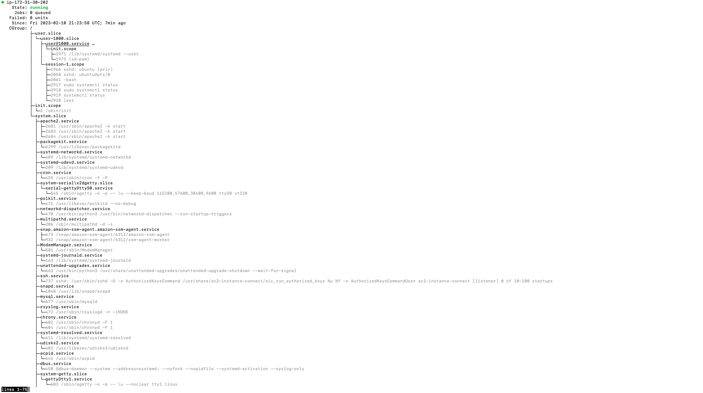
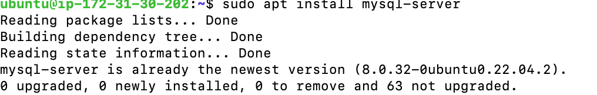
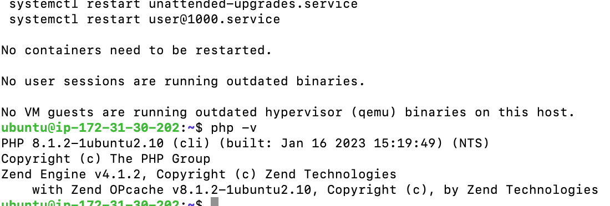
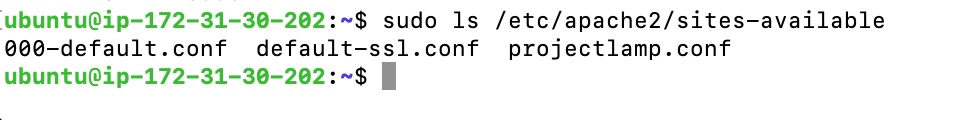
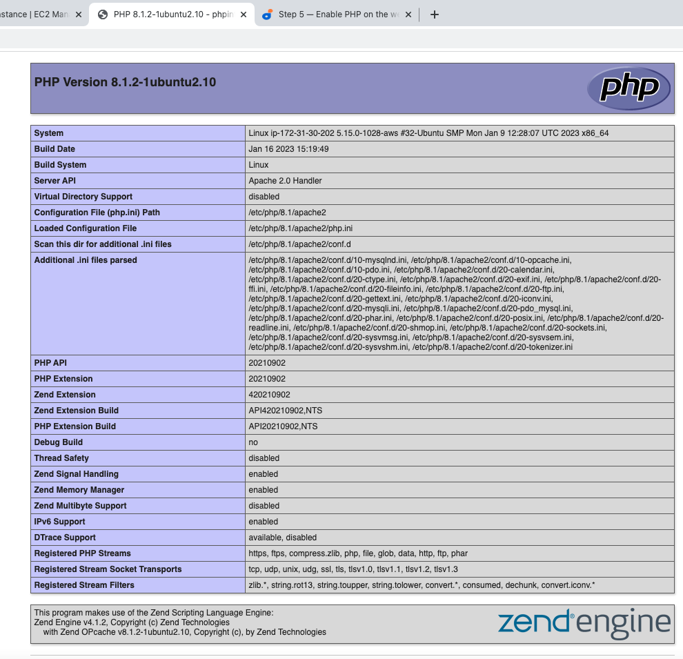

## Project 1 Documentation

### Installing apache2
To update packages in package manager
`sudo apt update`

To run apache2 package installation
`sudo apt install apache2`

To verify that apache2 is running as a service in our OS
`sudo systemctl apache2`

To check how we can access it locally in our Ubuntu shell,
`curl http://localhost:80`

The output is html code of the website

To retrieve your public IP Address
`curl -s http://169.254.169.254/latest/meta-data/public-ipv4`

To test Apache HTTP server, paste in a web browser (http://Public-IP-Address:80)

### Installing mysql
Using 'apt' to acquire and install software
`sudo apt install mysql-server`

To log in
`sudo mysql`

To define this user’s password as PassWord.1
`ALTER USER 'root'@'localhost' IDENTIFIED WITH mysql_native_password BY 'PassWord.1';`

Type 'exit' to quit

Start the interactive script by running:
`sudo mysql_secure_installation`

To log in with a password
`sudo mysql -p`

### Installing PHP lipapache2-mod-php php-mysql
To install these 3 packages at once, run:
`sudo apt install php libapache2-mod-php php-mysql`

To confirm your PHP version
`php -v`

### Creating a virtual host for your website using apache

Create the directory for projectlamp using ‘mkdir’ command as follows:
`sudo mkdir /var/www/projectlamp`

Next, assign ownership of the directory with your current system user:
`sudo chown -R $USER:$USER /var/www/projectlamp`

Then, create and open a new configuration file in Apache’s sites-available directory using your preferred command-line editor. Here, we’ll be using vi or vim (They are the same by the way):
`sudo vi /etc/apache2/sites-available/projectlamp.conf`

This will create a new blank file. Paste in the following bare-bones configuration by hitting on *i* on the keyboard to enter the insert mode, and paste the text:

`<VirtualHost *:80>
    ServerName projectlamp
    ServerAlias www.projectlamp 
    ServerAdmin webmaster@localhost
    DocumentRoot /var/www/projectlamp
    ErrorLog ${APACHE_LOG_DIR}/error.log
    CustomLog ${APACHE_LOG_DIR}/access.log combined
</VirtualHost>`

To save and close the file, simply follow the steps below:

1. Hit the **esc** button on the keyboard
2. Type **:**
3. Type **wq**. w for write and q for quit
4. Hit **ENTER** to save the file
You can use the **ls** command to show the new file in the sites-available directory

To quit without saving type **q** and press **enter**

To discard changes, type 'q!' and press 'enter'
With this VirtualHost configuration, we’re telling Apache to serve projectlamp using /var/www/projectlampl as its web root directory.If you would like to test Apache without a domain name, you can remove or comment out the options ServerName and ServerAlias by adding a # character in the beginning of each option’s lines. Adding the # character there will tell the program to skip processing the instructions on those lines.

`sudo ls /etc/apache2/sites-available`

You can now use 'a2ensite' command to enable the new virtual host:

`sudo a2ensite projectlamp`

To disable Apache’s default website use a2dissite command , type:
`sudo a2dissite 000-default`

To make sure your configuration file doesn’t contain syntax errors, run:
`sudo apache2ctl configtest`

Finally, reload Apache so these changes take effect: After every change, reload apache

`sudo systemctl reload apache2`

Your new website is now active, but the web root **/var/www/projectlamp** is still empty. Create an index.html file in that location so that we can test that the virtual host works as expected:

`sudo echo 'Hello LAMP from hostname' $(curl -s http://169.254.169.254/latest/meta-data/public-hostname) 'with public IP' $(curl -s http://169.254.169.254/latest/meta-data/public-ipv4) > /var/www/projectlamp/index.html`

Now go to your browser and try to open your website URL using IP address:http://Public-IP-Address:80

In case you want to change this behavior, you’ll need to edit the /etc/apache2/mods-enabled/dir.conf file and change the order in which the index.php file is listed within the DirectoryIndex directive:
`sudo vim /etc/apache2/mods-enabled/dir.conf`

After saving and closing the file, you will need to reload Apache so the changes take effect:

`sudo systemctl reload apache2`

Now that you have a custom location to host your website’s files and folders, we’ll create a PHP test script to confirm that Apache is able to handle and process requests for PHP files.

Create a new file named *index.php* inside your custom web root folder:
`vim /var/www/projectlamp/index.php`

This will open a blank file. Add the following text, which is valid PHP code, inside the file, separate lines:

**<?php**

**phpinfo();**

When you are finished, save and close the file, refresh the page and you will see a page similar to this:

After checking the relevant information about your PHP server through that page, it’s best to remove the file you created as it contains sensitive information about your PHP environment -and your Ubuntu server. You can use rm to do so:
`sudo rm /var/www/projectlamp/index.php`

